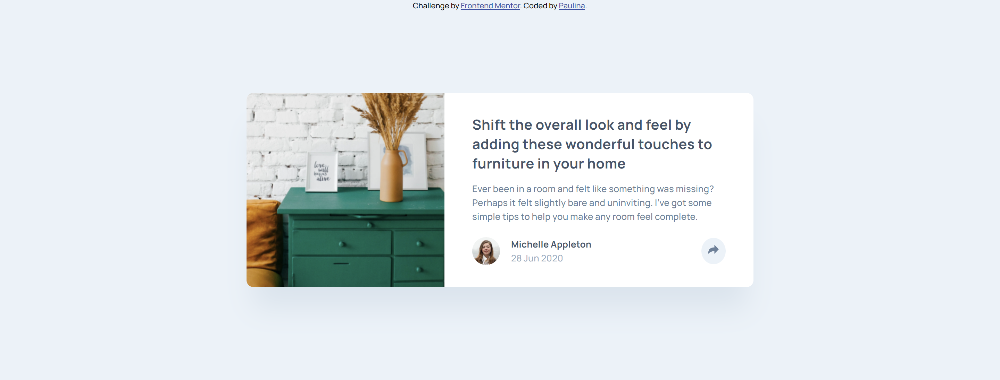

# Frontend Mentor - Article preview component solution

This is my own solution to the [Article preview component challenge on Frontend Mentor](https://www.frontendmentor.io/challenges/article-preview-component-dYBN_pYFT). Frontend Mentor challenges help improve coding skills by building realistic projects. 

## Table of contents

- [Overview](#overview)
  - [The challenge](#the-challenge)
  - [Screenshot](#screenshot)
  - [Links](#links)
- [My process](#my-process)
  - [Built with](#built-with)
- [Author](#author)

## Overview

### The challenge

Users should be able to:

- View the optimal layout for the component depending on their device's screen size
- See the social media share links when they click the share icon

### Screenshot

### Links

- Live Site URL: [Article Preview Component ](https://testerium-article-preview-component.netlify.app/)

## My process

I completed the entire project in 3 hours. I used HTML, SCSS, and JavaScript. I had some problems with positioning the grey "share" message box correctly. At first I could not position it in the right place, but I found a solution. The project is suitable for desktop and mobile views.

### Built with

- HTML
- CSS 
- SCSS
- Flexbox
- JavaScript

## Author

- Frontend Mentor - [@testerium](https://www.frontendmentor.io/profile/testerium)